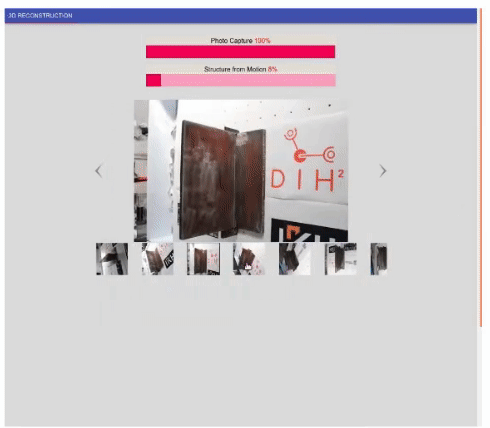

# roboweldar-3d-reconstruction


This is the 3D reconstruction module of the RoboWeldAR project. It takes as 
input a series of images and outputs a 3D mesh of the reconstructed model 
expressed in the world coordinate frame. 

The module can be called independently, as a standalone entity, or started 
as a client and spoken to via websocket and http.

The module can be called in web client mode, or as a standalone script.




## Getting Started

These instructions will get you a copy of the project up and running on your 
local machine for development and testing purposes. See deployment for notes 
on how to deploy the project on a live system.

Steps:
- `git clone --recursive git@github.com:ikh-innovation/roboweldar-3d-reconstruction.git` 
- `cd roboweldar-3d-reconstruction`
- `chmod a+x setup.sh`
- `./setup.sh`
- `python3.6 -m venv .venv`
- `source .venv/bin/activate`
- `pip install -r requirements.txt`
- `pip install -r src/rest/roboweldar_networking/interfaces/requirements.txt`

### Running the client

The module is able to talk to the main RoboWeldAR server instance, and 
receive commands delegated by the end user through the RoboWeldAR UI. To
run the 3D reconstruction as a service, run:

- `cd roboweldar-3d-reconstruction`
- `source .venv/bin/activate`
- `export PYTHONPATH=$PYTHONPATH:$(pwd); python src/rest/client.py --host "localhost"`

The service will open a websocket port, listening to incoming messages from
the server, perform a 3D reconstruction of the images sent through http, 
and return the reconstructed model to the server.

### Running the standalone module

To run the standalone Meshroom wrapper, from 

- `cd roboweldar-3d-reconstruction`
- `source .venv/bin/activate`
- `export PYTHONPATH=$PYTHONPATH:$(pwd); python src/reconstruction/reconstruction.py`

You can instantiate the Meshroom wrapper via
    ```    
    ThreeDReconstruction(path_to_meshroom_root, path_to_images_dir, path_to_output_dir, path_to_cache_dir)
    ```
where `path_to_meshroom_root` is the path to where the Meshroom binary files are located,
`path_to_images_dir` is the path to the directory containing the raw images, 
`path_to_output_dir` is the path where the reconstructed model will be placed,
 `path_to_cache_dir` is the path where the Meshroom cache files are saved for one session.


### Transforming the model to world coordinates

By default, the reconstructed model is placed in some coordinate frame that
depends on the convergence of the Meshroom algorithm. To transform this model
into the world frame, a script has been written, that uses the known camera
positions provided by the robot, in the world frame, to perform a series
of linear transformation (traslation, rotation, scaling) in order to bring the 
model into the world frame. 

More info on usage is found in the associated [README.md](/src/postprocessing/README.md).


## Running the tests

Explain how to run the automated tests for this system

### Break down into end to end tests

under construction
Explain what these tests test and why

```
Give an example
```

## Deployment using Docker

under construction.

## Authors

* **Orfeas Kypris** - *Initial work* - [orphefs](https://github.com/orphefs)

See also the list of [contributors](https://github.com/orgs/ikh-innovation/teams/roboweldar) who participated in this project.

## License

~~This project is licensed under the MIT License - see the [LICENSE.md](LICENSE.md) file for details~~

## Acknowledgments

* Props to the AliceVision Meshroom development community
* Props to my cats for being cool

