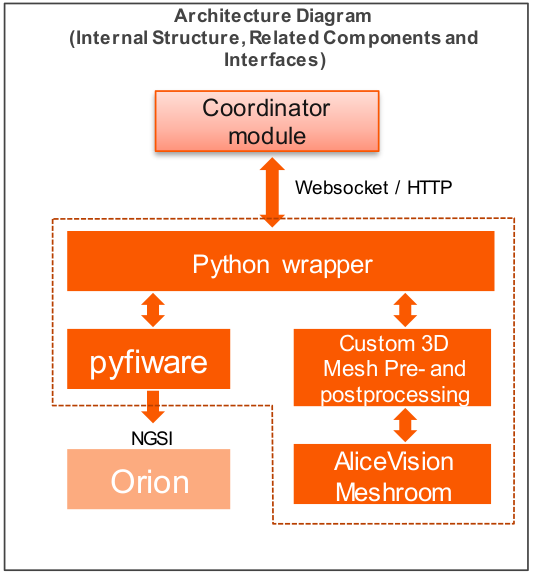

## Architecture description

This section contains an architecture description for the RoboWeldAR 3D reconstruction component.

## Internal Architecture

A concise document (work in progress) describing the internal connections and routes between all components can be found [here](../../architecture.pdf).

## Connection with FiWARE

The block diagram depicting the interconnecting blocks and how they connect to the Orion context broker can be seen below:

